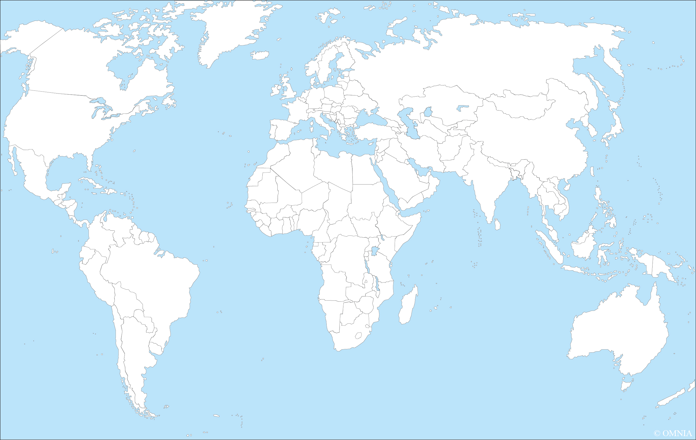
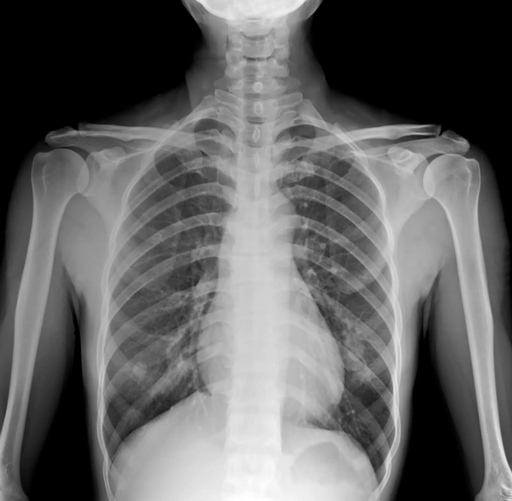
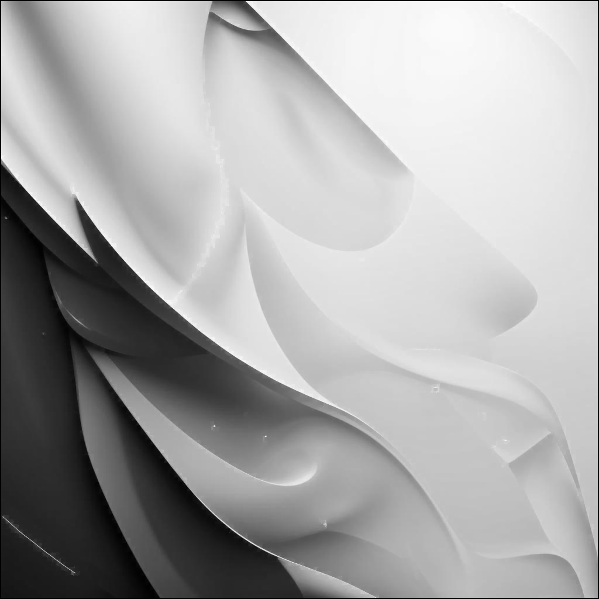
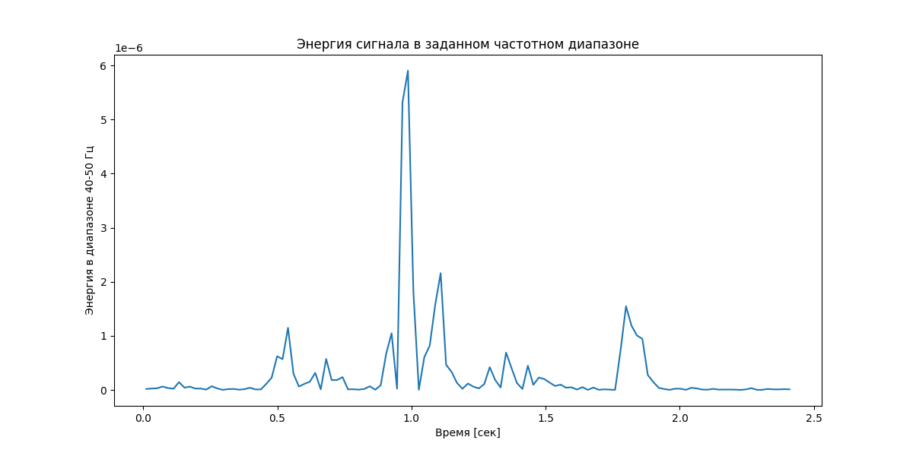

# Отчет по лабораторной работе №1

## Исходное изображение

## 1. Выделение компонент R, G, B
Были разделены каналы изображения. Ниже представлены результаты:
- Канал R: 
- Канал G: 
- Канал B: 

## 2. Преобразование изображения в HSI
Ниже представлены компоненты:
- Яркостная компонента: 
- Инвертированная яркостная компонента: 

## 3. Изменение размера изображения

### 3.1 Изначальные размеры изображения
Размер изображения: (1024, 1024)

### 3.2 Растяжение (интерполяция)
Коэффициент растяжения: M = 3  
Результат растяжения:   
Размер изображения: (3072, 3072)

### 3.3 Сжатие (децимация)
Коэффициент сжатия: N = 2  
Результат сжатия:   
Размер изображения: (512, 512)

### 3.4 Передискретизация в два прохода (растяжение + сжатие)
Коэффициент: K = M / N = 1.5  
Результат передискретизации в два прохода:   
Размер изображения: (1536, 1536)

### 3.5 Передискретизация в один проход
Коэффициент: K = 1.5  
Результат передискретизации в один проход:   
Размер изображения: (682, 682)

---

# Отчет по лабораторной работе №2 (Вар11)

## 1. Исходные данные
Входное изображение:   

## 2. Приведение к полутоновому
Результат:   
(Использовалось взвешенное усреднение R,G,B)

## 3. Адаптивная бинаризация (Феня и Тана, окно 3&times;3)
Коэффициент *k* = 0.2  
Результат бинаризации: 

## 1. Исходные данные
Входное изображение:   

## 2. Приведение к полутоновому
Результат:   
(Использовалось взвешенное усреднение R,G,B)

## 3. Адаптивная бинаризация (Феня и Тана, окно 3&times;3)
Коэффициент *k* = 0.2  
Результат бинаризации: 

## 1. Исходные данные
Входное изображение:   

## 2. Приведение к полутоновому
Результат:   
(Использовалось взвешенное усреднение R,G,B)

## 3. Адаптивная бинаризация (Феня и Тана, окно 3&times;3)
Коэффициент *k* = 0.2  
Результат бинаризации: 

---

# Отчет по лабораторной работе №3 (Вар48)

## 1. Исходное изображение
Входной файл: 
   

## 2. Морфологическое закрытие
Структурирующий элемент: 5&times;5 (квадрат)  
Результат закрытия:
  

## 3. Разностное изображение
Определяется как модуль разности оригинала и морфологически закрытого:
 

## 4. Бин. изображение

## 1. Исходное изображение
Входной файл: 
 
 

## 2. Морфологическое закрытие
Структурирующий элемент: 5&times;5 (квадрат)  
Результат закрытия:
  

## 3. Разностное изображение
Определяется как модуль разности оригинала и морфологически закрытого:
 

## 4. Бин. изображение

## 1. Исходное изображение
Входной файл: 
 

## 2. Морфологическое закрытие
Структурирующий элемент: 5&times;5 (квадрат)  
Результат закрытия: 

## 3. Разностное изображение
Определяется как модуль разности оригинала и морфологически закрытого:
 

## 4. Бин. изображение

---

# Отчет по лабораторной работе №4 (Вар4)

## 1. Исходное изображение
- Входной файл:  
- Размер: (1024, 1024)

## 2. Перевод в полутона
- Файл: 

## 3. Вычисление градиента
- Gx: 
- Gy: 
- G = |Gx| + |Gy|: 

## 4. Бинаризация градиента
- Порог: 50
- Результат: 

## 5. Морфологическая разность (дополнительно)
- Файл: 

---

# Отчет по лабораторной работе №5 (Вар20)

## 1. Введение
Задача: Выделение признаков для символов (армянские строчные буквы).

## 2. Входные данные
Папка: **symbols**  
Количество файлов: 38

## 3. Вычисленные признаки
Все скалярные признаки сохранены в файле **symbol_features.csv** (формат CSV с разделителем ';').

## 4. Профили X и Y
Для каждого символа построены профили X и Y и сохранены в папке **profiles** 
в виде столбчатых диаграмм: 
- <имя_символа>_profile_x.png 
- <имя_символа>_profile_y.png

Пример для одного из символов (иллюстрация):  
  

---

# Лабораторная работа №6: Сегментация текста (армянские строчные буквы)

## 1. Исходное изображение фразы

## 2. Профили изображения

## 3. Результат сегментации

---

# Лабораторная работа №7: Классификация символов (армянские строчные буквы)

## Алфавит — армянские строчные буквы

Размер шрифта 52
## Исходная строка: `սիրում եմ քեզ`  
## Распознанная строка: `սիրում ես քեզ`  
## Точность: 87.50%

## Подробные гипотезы:
1: [('armenian_1405', 0.9797), ('armenian_1387', 0.8585), ('armenian_1383', 0.8392), ('armenian_1381', 0.7277), ('armenian_1392', 0.7097), ('armenian_1385', 0.7093), ('armenian_1396', 0.6907), ('armenian_1388', 0.6735), ('armenian_1384', 0.6586)]  
2: [('armenian_1387', 0.9576), ('armenian_1404', 0.8772), ('armenian_1391', 0.8270), ('armenian_1393', 0.7062), ('armenian_1382', 0.7053), ('armenian_1380', 0.7047), ('armenian_1394', 0.6719), ('armenian_1389', 0.6658), ('armenian_1387', 0.6626)]  
3: [('armenian_1394', 0.8508), ('armenian_1403' 0.8543), ('armenian_1381', 0.8495), ('armenian_1384', 0.7288), ('armenian_1392', 0.6732), ('armenian_1390', 0.6646), ('armenian_1385', 0.6338), ('armenian_1382', 0.6303), ('armenian_1388', 0.6102)]  
4: [('armenian_1400', 0.9541), ('armenian_1404', 0.8555), ('armenian_1385', 0.8208), ('armenian_1384', 0.7170), ('armenian_1393', 0.7167), ('armenian_1380', 0.6940), ('armenian_1382', 0.6919), ('armenian_1405', 0.6829), ('armenian_1394', 0.6145)]  
5: [('armenian_1392', 0.9340), ('armenian_1389', 0.8493), ('armenian_1390', 0.8087), ('armenian_1386', 0.7860), ('armenian_1394', 0.7656), ('armenian_1382', 0.7333), ('armenian_1388', 0.6438), ('armenian_1391', 0.6290), ('armenian_1380', 0.6050)]  
6: [('armenian_1380', 0.9557), ('armenian_1382', 0.8445), ('armenian_1393', 0.7779), ('armenian_1384', 0.7557), ('armenian_1391', 0.7527), ('armenian_1388', 0.7510), ('armenian_1393', 0.7485), ('armenian_1383', 0.6531), ('armenian_1387', 0.6307)]  
7: [('armenian_1378', 0.8806), ('armenian_1393', 0.8540), ('armenian_1382', 0.8533), ('armenian_1386', 0.7754), ('armenian_1389', 0.7062), ('armenian_1384', 0.6822), ('armenian_1380', 0.6713), ('armenian_1385', 0.6697), ('armenian_1390', 0.6248), ('armenian_1381', 0.6132)] 
...
---

## Эксперимент с изменённым шрифтом  
Размер шрифта: 60  
Распознанная строка: `սրրտմ եք քեզ`  
## Точность: 83.33%  

---

# Лабораторная работа №8: Текстурный анализ и контрастирование (Вар5)

## Вариант 5

## Исходные и преобразованные изображения
  
**Рисунок 1.** Исходное изображение

  
**Рисунок 2.** Результат степенного преобразования (gamma=0.5)

## Карты локальных бинарных шаблонов (LBP)
  
**Рисунок 3.** LBP-карта исходного изображения

  
**Рисунок 4.** LBP-карта после преобразования

## Гистограммы яркости
  
**Рисунок 5.** Сравнение гистограмм яркости

## Гистограммы LBP
  
**Рисунок 6.** Распределение LBP-паттернов

## Анализ результатов
1. Степенное преобразование с gamma=0.5 увеличило контраст
2. Изменения в распределении LBP-паттернов показывают модификацию текстурных характеристик
3. Гистограмма яркости демонстрирует расширение динамического диапазона

---

# Лабораторная работа №9. Анализ шума

## 1. Исходные данные
- Анализируемый файл: `sound.wav`
- Частота дискретизации: 44100 Гц
- Длительность: 2.44 сек
- Уровень шума: 0.0054

## 2. Спектральный анализ

### Оригинальный сигнал

## Результаты фильтрации

### Фильтр Савицкого-Голея  

### Фильтр Винера 

### Фильтр Низких частот 

## 3. Анализ энергии
- Шаг анализа: 0.1 сек
- Анализируемый частотный диапазон: 40-50 Гц
- Моменты с максимальной энергией: [np.float64(1.3), np.float64(0.5), np.float64(1.8)] сек

## 4. Выводы
В ходе работы были проанализированы три метода фильтрации:
1. **Фильтр Савицкого-Голея** - хорошо сохраняет форму сигнала
2. **Фильтр Винера** - эффективен против аддитивного шума
3. **НЧ-фильтр** - удаляет высокочастотные помехи

---

# Лабораторная работа №10. Обработка голоса

## Звук "А"
- Минимальная частота: 70.31 Гц
- Максимальная частота: 1312.50 Гц
- Основной тон с наибольшим количеством обертонов: 93.75 Гц
- Три самые сильные форманты: 93.75, 609.38, 1218.75 Гц

## Звук "И"
- Минимальная частота: 70.31 Гц
- Максимальная частота: 375.00 Гц
- Основной тон с наибольшим количеством обертонов: 187.50 Гц
- Три самые сильные форманты: 93.75, 281.25, 468.75 Гц

## Звук "гавканье"
- Минимальная частота: 129.20 Гц
- Максимальная частота: 1184.33 Гц
- Основной тон с наибольшим количеством обертонов: 882.86 Гц
- Три самые сильные форманты: 258.40, 473.73, 882.86 Гц

